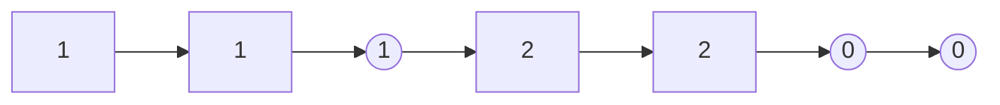
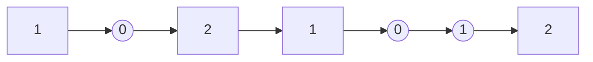

# 窗口打散算法设计
## 1.背景介绍
在广告、搜索、推荐系统中，用户发出一次请求，系统给用户呈现一些元素，例如：活动、商品、视频等。这些元素是根据权重进行过排序的，但是排序的时候通常没有考虑视觉效果，从而可能产生同类元素不断重复出现的问题，影响阅读的舒适性。因此，对展示结果进行打散，以增加元素的多样性，得到更好的视觉体验，显得非常重要。
本工作对窗口打散算法进行研究，随机生成一个视频库，产生视频列表，设计算法对该列表进行重排，通过滑动窗口指定规则来检验算法的有效性。
## 2.数据构建
构建一个视频库，视频包含作者id（1000个）、品类（30个）和背景音乐（100个）三个特征。构建方法为：生成相应数量的数字序列，并且固定种子的条件下打乱顺序。(data.py)
根据视频库特征，构建视频列表。构建方法：分别从作者、品类、背景音乐特征集中进行采样，构建出包含三种特征的视频。默认构建20个，组成视频集合。视频集合的维度为(20,3)。假设构建的视频列表为经过排序后的结果，目标是将其打散。
## 3.算法设计
### 3.1 Random
对视频列表进行一次shuffle，将shuffle后的列表视作打散的结果。以此方法作为最基本的baseline。
### 3.2 Weight
权重分配法：综合考虑作者、品类和背景音乐三个因素。
对每一个对象定义一个新的权重：
$$f(x)=\sum_i W_i * Count_i$$
W为每种属性分配的系数，代表打散的优先度。count则代表该对象此属性已经出现的次数。相似的属性出现的越多，权重就会越大。在为所有样本分配了新的权重之后，按照权重进行排序，即作为打散的结果。
举例：

假设现在有两种属性：形状和数字，形状权重系数为1，数字权重系数为2
对所有样本计算新权重：
1： W = 1 * 0 + 3 * 0 = 0  形状和数字都未出现过
2： W = 1 * 1 + 3 * 1 = 4  形状和数字都出现1次
3： W = 1 * 0 + 3 * 2 = 6  形状未出现过，数字出现2次
4： W = 1 * 2 + 3 * 0 = 2  形状出现2次，数字未出现过
5： W = 1 * 3 + 3 * 1 = 6  形状出现3次，数字出现1次
6： W = 1 * 1 + 3 * 0 = 1  形状出现1次，数字都未出现过
7： W = 1 * 2 + 3 * 1 = 5  形状出现2次，数字出现1次
根据计算出的新权重进行排序，得到如下结果：

通过设置权重系数能够实现优先扰乱某个属性。例子中为数字设置了更大的权重，因此优先打乱了数字分布，而形状因为系数较小，一定程度可以容忍他们相邻。
该方法的优点是简单直接，综合考虑多种因素打散，而且可以为不同因素设置权重。缺点是容易出现末尾失效，后续实验结果也证明了在一些场景下末尾失效非常严重，但是通过更改权重参数能够一定程度缓解这种情况。
### 3.3 window
滑动窗口法，严格按照评价规则来设计的一种方法。具体做法为：定义一个滑动窗口，遍历整个视频列表，将视频列表中的样本加入到一个空的reranked列表中，当前样本是否能够加入的条件为——加入当前样本不会使得以当前样本作为结尾且滑动窗口长度为8的窗口中所含作者数量作者数量>2，品类数量>3，音乐数量>1（该规则为是否成功的评价标准）。若最终原视频列表剩余的样本都不满足条件，那么直接将原视频列表extend到reranked列表中。
该方法一个最大的问题就是，一旦出现原视频列表剩余样本都不满足条件的情况，那么该次实验结果就一定是错误的，错误的原因是末尾失效。
根据实验结果分析，由于规则中对音乐的要求较高，要求窗口内的同种音乐只能出现一次，因此音乐单项规则的准确率非常低。如果将规则对音乐的要求调高，将很大程度改善这种情况。
### 3.4 new window
该方法是对window方法的改善，上文对window方法中的错误原因进行了一些分析。认为是规则对音乐要求较高，通过多次测试，发现绝大多数情况确实是由于不满足音乐条件造成的。从本质上讲，在window算法中，我希望所有的原视频列表数据都能按照规则加入到reranked中，因此，最终不符合条件的样本，我希望提供给他几次特殊的机会，去和前面已经reranked 的样本进行交换，交换的前提是不影响reranked满足规则。在给了多次机会后依然不满足，就退出循环，结束本次实验。
基于该想法，下面给出一个window方法的错误案例：
假设原视频列表长度为20，用window方法从原视频列表往reranked视频列表里面加入样本。中间出现这样的结果：

```python
reranked = [[509, 27, 32], [758, 20, 68], [906, 15, 98], [952, 19, 22], [212, 18, 28], [131, 15, 77], [530, 26, 58], [441, 29, 85], [314, 4, 63], [965, 9, 57], [387, 6, 66], [955, 11, 22], [254, 15, 38], [692, 23, 3], [979, 18, 18], [564, 6, 82], [868, 1, 63], [44, 12, 0], [379, 21, 44]]
video_list = [[34, 11, 3]]
# len(reranked) = 19, len(video_list) = 1
```
上述结果表示原视频列表中剩余最后一个样本，不满足window算法的条件插入到reranked中。可以发现，其原因是reranked中倒数第六个样本[692, 23, 3]中第三维（音乐）与原视频列表video_list中想同，不满足音乐数量<=1的条件。
因此，我设计给剩余样本[34, 11, 3]一个机会与reranked里的样本进行交换，交换时要求交换后不能影响reranked的正确性。在该样例中，[34, 11, 3]能够成功与[509, 27, 32]交换。得到以下结果：
```python
reranked = [[34, 11, 3], [758, 20, 68], [906, 15, 98], [952, 19, 22], [212, 18, 28], [131, 15, 77], [530, 26, 58], [441, 29, 85], [314, 4, 63], [965, 9, 57], [387, 6, 66], [955, 11, 22], [254, 15, 38], [692, 23, 3], [979, 18, 18], [564, 6, 82], [868, 1, 63], [44, 12, 0], [379, 21, 44]]
video_list = [[509, 27, 32]]
# len(reranked) = 19, len(video_list) = 1
```
在这种情况下，video_list的剩余样本能够正确插入到reranked中。相当于在window基础上，成功挽救了一个错误案例。因此，可以认为new window算法在准确率上一定优于window算法。后续实验进行了更详细的对比分析。
## 4.实验
检测视频列表是否成功打散的标准：设定一个长度为8的滑动窗口，如果在所有的8个单位窗口中，同类作者数量<=2，品类数量<=3，音乐数量<=1。即视作成功打散。
每次生成不同的视频列表，重复进行10000次实验。
### 4.1 窗口打散算法准确率实验
每种算法重复进行10000次实验，若rerank后的视频列表满足规则，则视作成功打散，统计10000次实验中成功的比率。该组实验中还调整了原视频序列的长度，即从视频库构建长度从10到100不同长度的视频列表。视频库特征数量固定为（作者id1000个，品类30个，背景音乐100个）weight算法中的权重为（作者：1，品类：1， 音乐：1）
下图展示了在不同列表长度下，所有规则成功率和单属性规则的成功率。
（1）在默认setting即列表长度为20下，三种打散算法都明显优于random，new window算法达到了最高98.65%成功率。
（2）随着列表长度增加，random和weight的成功率受到很大程度的影响，weight受较大影响的原因是三种属性具有相同权重，随着问题难度加大，视频的组合种类增多，该算法的末尾失效问题不断放大。相比之下，window算法较为稳定，因为window算法是否成功，主要取决于最后的一些样本是否能分配成功。
（3）改进后的new window算法，相比于window算法取得了较大提升，也符合new window算法成功率一定优于window算法的预测，同时，随着列表长度增大，new window算法准确率还有一些上升，列表长度为10反而成功率较低（95.92），分析原因是因为当出现window算法的错误情况时，原视频列表不符合条件的样本尝试与reranked列表进行交换，但由于总的列表样本非常少，更大概率无法完成交换，因此产生了较低的准确率。
（4）作者和品类的条规则成功率较高，有两个原因：1、相比于采样的视频列表长度，特征库数量较多(1000,30)；2、考核规则较为宽松（作者<=2,品类<=3）。
（5）背景音乐单个属性规则成功率较低，最大的原因是考核规则非常严格（音乐<=1），一旦出现一个重复就算作失败，因此希望算法能够更加主动把相同背景音乐的样本分开。基于此，我预测，如果将音乐的规则调整更加宽松，例如将规则从<=1调整为<=2或者将视频特征库音乐的100类增加为1000类，都会一定程度缓解这种现象。此外，在weight方法中，预测增大音乐的权重会取得更好的效果。后续的实验证明了上述预测的正确性。

### 4.2 打散规则与特征库数量调整分析
本组分析实验由实验4,1的分析（5）引出：
调整了打散规则作者<=2、品类<=3、音乐<=1，变为作者<=2、品类<=3、音乐<=2。
特征数量作者id1000类，品类30，背景音乐100类，变为作者id1000类，品类30，背景音乐1000类。

调整打散规则实验：
实验4.1分析认为，考核规则中要求音乐<=1，很大程度放大了算法的末尾失效问题。一旦有一个重复就会导致实验失败，因此将音乐的要求调整为<=2，实验结果证明了上述分析的正确性。
（1）修改打散规则后，所有算法都有较大准确率的提升，可以直观的理解为，打散规则的放宽，提高了容错率。减少了末尾失效的影响。


调整特征库数量实验：
实验4.1分析认为，音乐不符合规则是最大的原因，因此如果增大特征库中的音乐种类，同样也能减少音乐不符合规则的可能性。因此本组实验扩充了特征库中音乐的类别。
（1）增加特征库中音乐的类别后，所有算法都有较大准确率提升。提升的原因同样也是提高了容错率。本质上是降低了构建原视频列表时产生同种音乐的可能性。


### 4.3 weight 算法权重调整分析
weight算法能够为不同因素设置权重，综合考虑多种因素打散。在之前的实验中weight算法关于作者、品类和背景音乐的权重为1,1,1。所以如实验4.1分析（2）所述，在打散的时候没有侧重点，因此，本组实验调整了weight算法的权重，让其侧重考虑音乐这个因素，优先打散音乐。
（1）随着音乐所占权重的增加，实验结果有较大提升，权重系数从5增加到10不再具有明显提升。由此可见 ，增加音乐的权重系数，能够让算法侧重根据音乐因素来打散，一定程度提高了算法成功率。

### 4.4 窗口打散算法耗时分析
本组实验对各算法的耗时进行分析。
（1）随着列表长度增加，算法需要处理的数据量增加，所需时间也随之增加，
（2）weight算法的时间复杂度最高，因为其需要先对所有样本计算新的权重，再进行排序，排序的时间复杂度为O（nlogn）
（3）window算法耗时比weight算法低，优化后的new window算法由于增加了交换流程，因此产生了额外的时间消耗。

### 4.5 窗口打散算法原序保持度分析
本组实验是自己拟定的一个非常简单的指标，具体为：判断原序列位于前50%的样本，是否在rerank后的列表里也在前50%。50%这个阈值可以调整。下表的结果为，原序列位于前50%的样本rerank后也在列表前50%的比例。
（1）random方法的结果为50%左右，即随机打散。
（2）weight方法相比于window和new_win没有那么尊重原序，因为其计算权重的时候更看重几项属性，如果想让该算法更加尊重原序可以将原序的信息纳入权重考虑内。
（3）new_win相比于window算法尊重原序的程度有所降低，主要是因为存在交换的过程，数据交换很容易将原本靠后的数据交换到前面。


## 5.总结
本项工作主要是针对推荐系统多样性重排算法的一个分析demo，设计实现了三种重排算法，最终取得了较好的打散成功率。然而，打散的成功率高，并不代表着能够有较好的推荐效果。衡量打散对于推荐效果的影响，可以从用户主观评估、点击率指标、推荐满意度指标、离线评估指标、在线评估指标来分析。
用户主观评估：分析打散对于推荐命中率的影响，是否成功让用户观看具备多样性的视频序列。
点击率指标：对于打散后的视频，用户是否进行过收藏、点击、分享等操作。
推荐满意度指标：视频留存率、用户观看停留时长、视频播放完成率等。
离线评估指标：用打散结果计算准确率、召回率、F1值、MAE、覆盖率（推荐类别数/总数）、时效性等
在线评估指标：响应及稳定性、产生行为指标
该项目的缺点：
1.算法由python实现，算法复杂度本身也有很多可以优化的地方。
2.算法设计的细节部分还存在漏洞。例如，在解决window算法末尾失效问题是，提出的new window方法，在交换过程的设计中，没有考虑原序的问题，始终优先与排在前面的样本进行交换。虽然提高了打散成功率，但是推荐效果非常直观的会有所降低，因为排序非常靠前的样本被交换到了非常靠后的地方。如3.4中的例子所示。
3.对于是否尊重原序的实验，可以有更加合理的考核指标。
